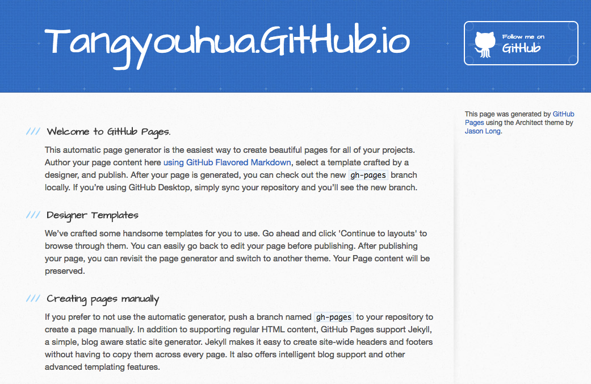
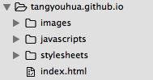
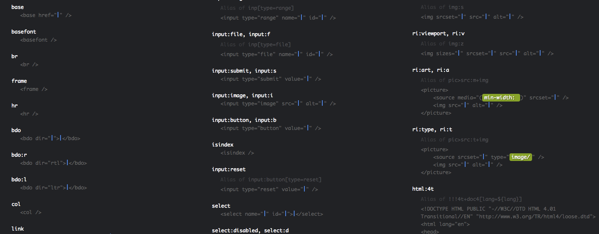
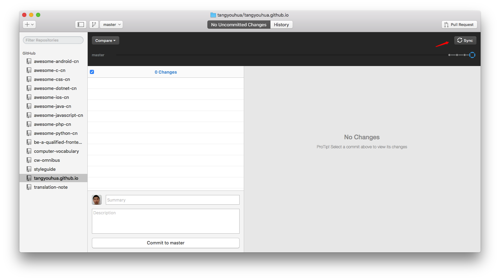

# 第4天：起步，我的第一个网站

> 学习的最终目标不是为了学到知识，而是要整出点好玩的东西。比如网站。

## 用Github快速搭建自己的网站
搭建网站需要注册域名、租用网络空间/主机、提交自己的网站内容。

> 用Github可以快速、免费地达到这些目标。

详细的步骤可以参见[这篇介绍](http://blog.csdn.net/renfufei/article/details/37725057/)。

下面简要地介绍一下其中的步骤：

- 如果还没有Github账号，先注册一个；
- 建立一个名为 `你的名字.github.io` 的仓库（repository）；
- 按照介绍文章中的进行设置；
- 稍等几分钟，你就得到了一个自己的网站。

像下面这样：



当然，是 Github Pages 默认生成的模板，我的目标是**理解并且自己整出来**。

于是，把所有的内容清除掉，保留目录和 `index.html`。目录结构像下面这样：



接下来就开始学习HTML，开启学习之旅啦。

## 选择一个合适的编辑器
> 选择什么样的工具比较好？管用就行！

我习惯用 SublimeText 作为编辑器，通过 Emmet 插件可以很方便地进行开发。

怎么叫方便呢？

比如我想输入一个4行的无序列表，只要巧如 `ul>li*4` 再按下 `Tab` 就OK了。

得到的代码如下：

	<ul>
		<li></li>
		<li></li>
		<li></li>
		<li></li>
	</ul>

Emmet提供的[快捷键(CheetSheet)](http://docs.emmet.io/cheat-sheet/)基本上可以涵盖了所有的需要的html标签及结构。



## 建立主页
下面是主页的第一版，我一共输入了以下内容：

- `html:4t` 按下 `Tab`
- 修改标题，`<title></title>` 加上 **两个月成为靠谱前端**
- 在 `<body>` 中间输入  `ul>li*5` ，然后填入分类内容

```html
    <!DOCTYPE HTML PUBLIC "-//W3C//DTD HTML 4.01 Transitional//EN" "http://www.w3.org/TR/html4/loose.dtd">
    <html lang="en">
    <head>
      <meta http-equiv="Content-Type" content="text/html;charset=UTF-8">
      <link rel="shortcut  icon" type="image/x-icon" href="images/favicon.ico" media="screen"  /> 
      <title>两个月成为靠谱前端</title>
    </head>
    <body>
      <h1>网站内容分类</h1>
      <ul>
        <li>HTML</li>
        <li>CSS</li>
        <li>JavaScript</li>
        <li>资源</li>
        <li>关于我</li>
      </ul>
    </body>
    </html>
```

保存完毕。

## Github Desktop
对Github命令行不熟悉的朋友，可以像我一样\*_\* 用Github Desktop图形化工具。

### 克隆(clone)项目到本地


### 提交到站点



## 下一步行动
- 对分类中的每个知识点，比如HTML，建立子页面，进行实践
- 对资源页面进行整理，提供相关工具和库的使用说明


